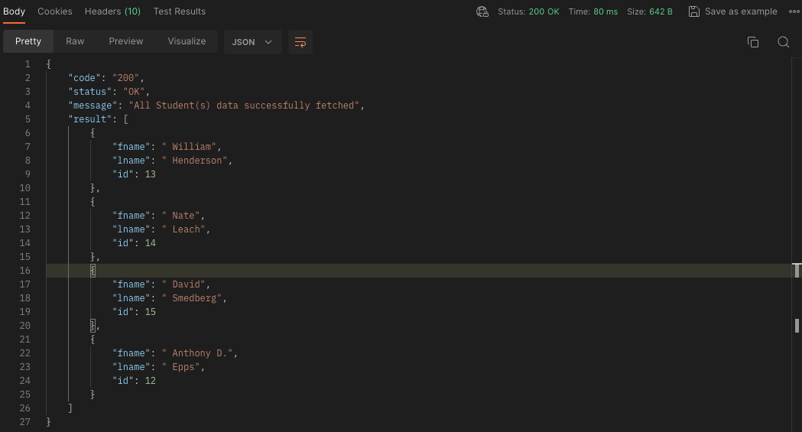
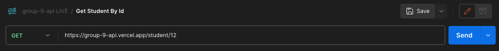
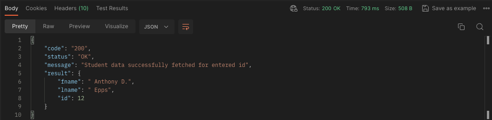
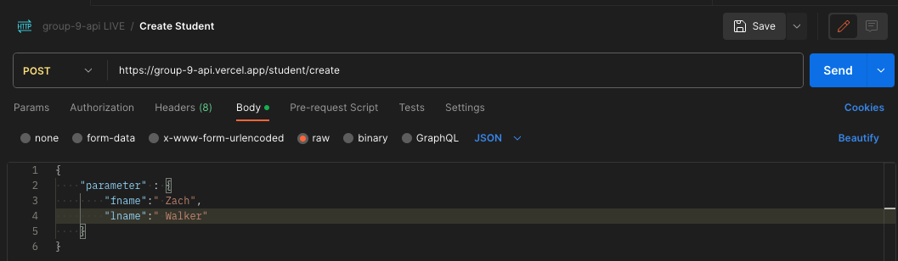
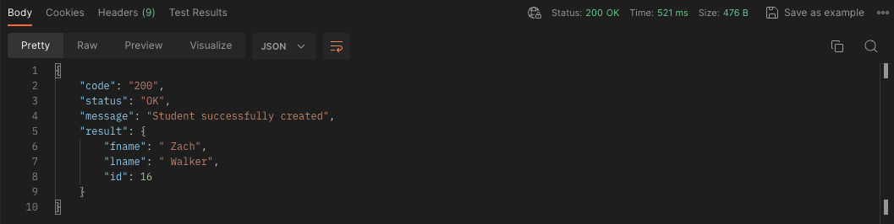
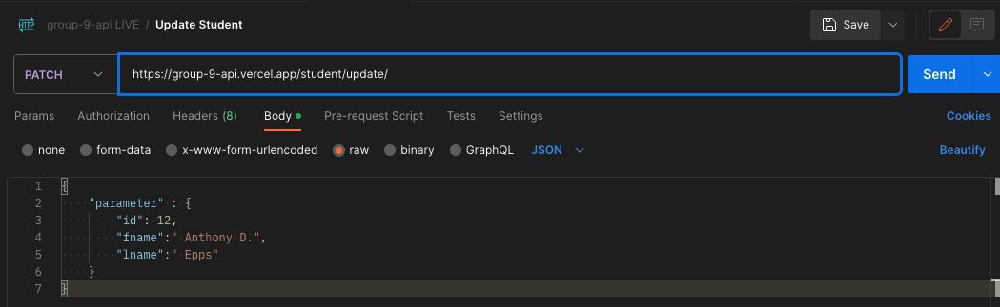
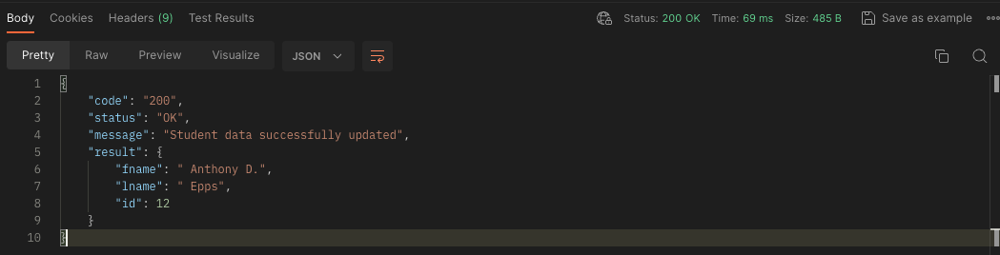
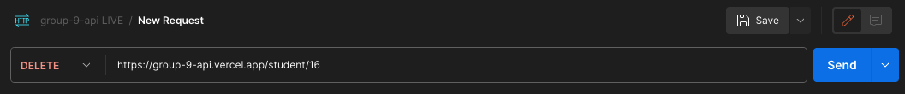
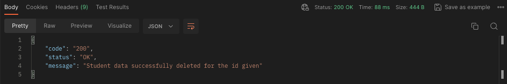

# Group-9-API

- API that will be used for API Lab
- All Endpoints are listed below, more can be added if needed

## Endpoints

[Official Docs](https://group-9-api.vercel.app/docs)

## Documentation

### *GET*

- `GET:/student` endpoint returns a list of all current Student objects in the database

- This endpoints takes no parameters and is a simple getter statement. Your result should be similar to the image below, returning a list of all students:

### *GET BY ID*

- `GET:/student/<id>` endpoint returns the student with the corresponding ID that is passed IN THE URL

- This endpoints takes one integer parameter and is a simple getter statement. Your result should be similar to the image below, resulting in a single student returned with corresponding ID:

### *POST*

- `POST:/student/create` endpoint creates a new Student and adds it to the database

- This endpoints takes no URL parameters. It does however; require a body (Click Body -> RAW ->JSON) of a fname and lname parameters that will be POSTED to the database. Your result should be similar to the image below, resulting in a new student:

### *PATCH*

- `PATCH:/student/update` endpoint creates a new Student and adds it to the database

- This endpoints takes no URL parameters. It does however; require a body (Click Body -> RAW ->JSON) of ID, fname, and lname parameters that will be PATCHed to the database. Your result should be similar to the image below, resulting in a changed entry based on the ID passed in the BODY:

### *DELETE*

- `DELETE:/student/<id>` endpoint deletes the Student from the database based on the ID passed IN THE URL

- This endpoints takes one integer parameter and is a simple getter statement. Your result should be similar to the image below, returning a confirmation message of Student being deleted:

### WebApp Implementation Coming Soon
